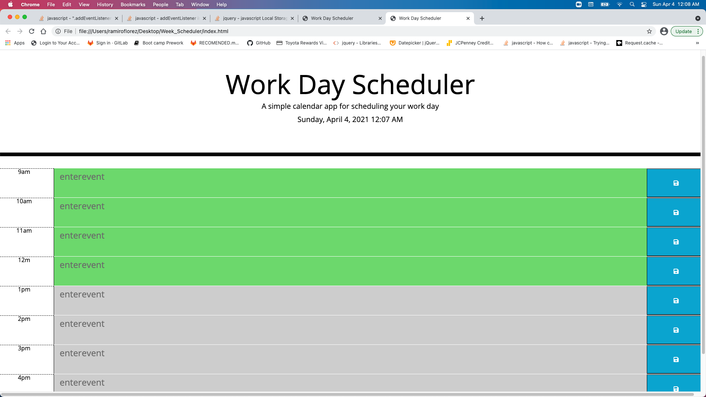

To create my # Week_Scheduler, I linked the HTML file provided with the provided CSS and the JS file that I created.
Then, I created "divs", "textareas" and "buttons" to create the timeblocks.
I used the specific sintax to include momentjs and bootstrap codes.
By using momentjs, I created the current day to display upon loading the page.
In the same way, I created the times in the timeblocks.
I used the classes "past", "present" and "future" to make the events color coded.
Finally, I used local store to save the events in the browser.
here is the link to the github pages.
https://ramflorez.github.io/Week_Scheduler/

See snapshot below.

